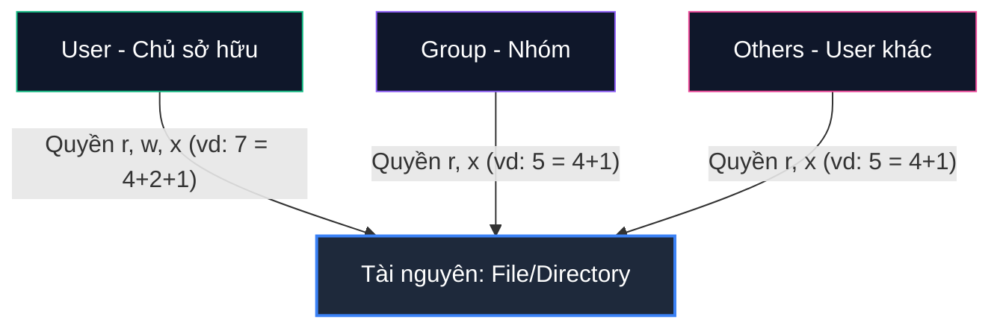

Bài này giúp bạn map các lệnh Linux cơ bản với các khái niệm Security quen thuộc. Mục tiêu: Bỏ chuột, thao tác 100% bằng bàn phím.

---

## Ngày 1: Quản trị Linux qua Terminal

Khi SSH vào server hay K8s, bạn chỉ có màn hình dòng lệnh. Hãy coi hệ thống file của Linux như một bề mặt tấn công (attack surface) cần được rà soát và bảo vệ.

### 1. Điều hướng và Quản lý file

* **`pwd`**: Xem thư mục hiện tại (như việc xác định bạn đang đứng ở network zone nào).
* **`mkdir folder_name`**: Tạo thư mục mới.
* **`cd folder_name`**: Di chuyển vào thư mục. Dùng `cd ..` để lùi ra một cấp.
* **`ls -la`**: Liệt kê file. **Luôn dùng `-la`** để thấy cả file ẩn (.env, .ssh) và quyền của file. Dân bảo mật phải nhìn thấy mọi thứ.
* **`rm -rf folder_name`**: Xóa không hỏi. Lệnh này rất nguy hiểm. Nếu hacker chạy được lệnh này ở quyền root, hệ thống bay màu. Đó là lý do phải áp dụng triệt để nguyên tắc **Least Privilege** (Quyền tối thiểu).

### 2. Xử lý Text - "SIEM" trên Terminal (grep, awk, sed)

Đọc log là việc hàng ngày. Dùng 3 lệnh này để truy vấn log trực tiếp trên terminal.

**Tạo file log mẫu:**
`echo -e "ID STATUS IP\n1 ERROR 192.168.1.1\n2 OK 10.0.0.1\n3 ERROR 127.0.0.1" > log.txt`

* **Tìm kiếm (`grep`)**: `grep "ERROR" log.txt`
  Giống viết rule trên SIEM: Bắt các dòng có chữ ERROR (ví dụ: "Failed password" trong auth.log).
* **Lọc cột (`awk`)**: `awk '{print $1, $3}' log.txt`
  Trích xuất đúng thông tin cần thiết (ID và IP). Rất tiện khi phân tích log truy cập.
* **Tìm và Thay thế (`sed`)**: `sed -i 's/127.0.0.1/0.0.0.0/g' log.txt`
  Đổi hàng loạt chuỗi. Giống như lúc bạn cần replace config hàng loạt để chặn IP độc hại.

### 3. Phân quyền File (chmod, chown)

Cơ chế này giống hệt cấu hình ACL trên Firewall hay RBAC. 



Linux chia quyền cho 3 đối tượng:
1. **u (User)**: Chủ file.
2. **g (Group)**: Nhóm sở hữu.
3. **o (Others)**: Những user khác.

3 loại quyền cơ bản:
* **r (Read) = 4**: Quyền đọc.
* **w (Write) = 2**: Quyền sửa.
* **x (Execute) = 1**: Quyền chạy file (quan trọng để chặn malware thực thi).

**Thực hành:**
* **`chmod 755 log.txt`**: Cấp quyền. 7 (4+2+1) cho User (Đọc, Ghi, Chạy), 5 (4+1) cho Group và Others (Đọc, Chạy).
* **`chown root:root log.txt`**: Đổi chủ file. Các file cấu hình nhạy cảm luôn phải thuộc về user root.

---

### 4. Bài tập thực hành

**Bước 1: Tạo file giả lập tấn công**
```bash
echo -e "INFO: SSH from 10.0.0.5\nERROR: Failed password from 203.0.113.99\nINFO: SSH from 10.0.0.5\nERROR: Failed password from 198.51.100.42" > auth.txt
```

**Bước 2: Lọc Log**
Dùng `grep` lọc các dòng chứa "ERROR" (nghi là brute-force attack). *Mẹo: Tìm hiểu `grep -v` để làm thao tác ngược lại.*

**Bước 3: Hardening file**
Gõ `chmod 000 auth.txt`. Sau đó thử đọc file bằng `cat auth.txt`. 
Bạn sẽ thấy thông báo **Permission denied** – Đây là lớp bảo vệ hoạt động khi hacker chiếm được user thường nhưng không có quyền đọc file nhạy cảm.

**Câu hỏi tư duy:**
1. File đang là `000`. Dùng lệnh `chmod` nào để bạn (Owner) Đọc + Ghi được, nhưng cấm tuyệt đối người khác?
2. File Private Key (`id_rsa`) nên để quyền `chmod` bao nhiêu để không bị SSH từ chối kết nối do lỗi insecure permissions?